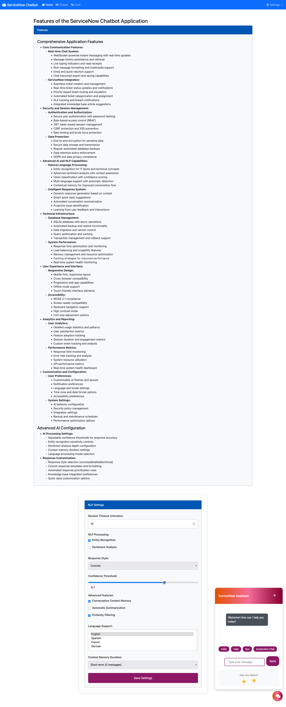
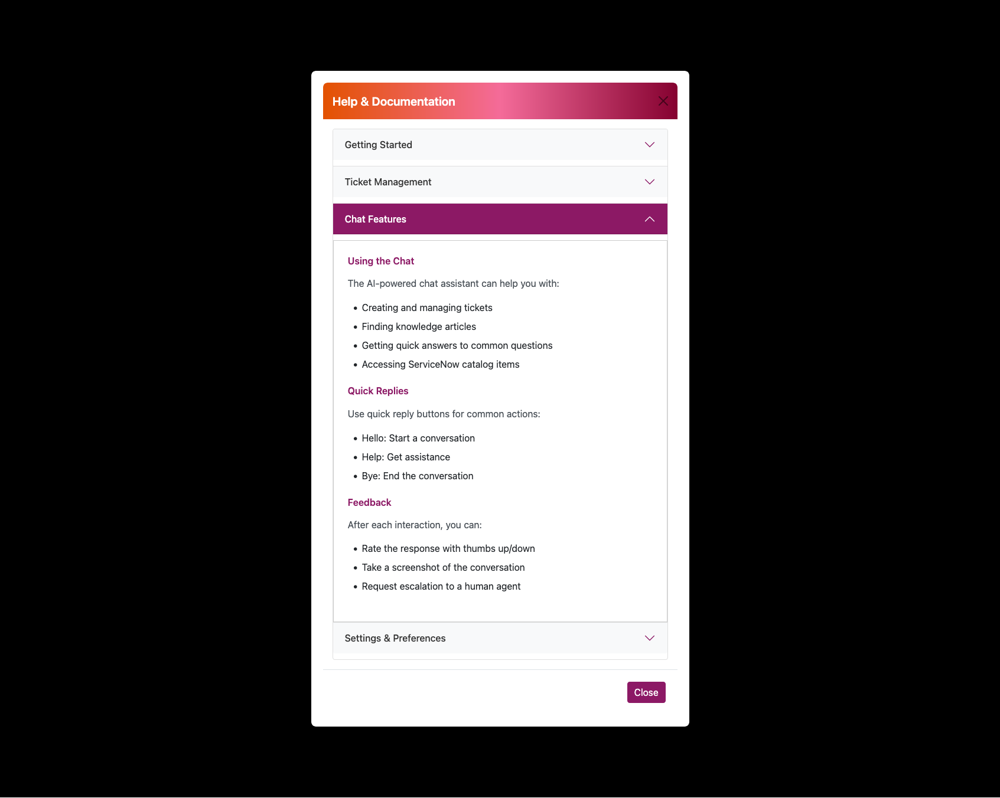

# ServiceNow-Chatbot
An intelligent chatbot interface for ServiceNow integration (from scratch) with advanced NLP capabilities (spaCy's blank model for modularity with NLTK for a lightweight approach) and real-time communication features.


## Features

### Core Functionality
- Real-time WebSocket chat with message history
- ServiceNow ticket integration and management
- Secure session handling and rate limiting
- User feedback and analytics system

### Technical Features
- SQLite database with automated backups
- Input validation and security measures
- Responsive design with accessibility support
- Environment-based configuration

### AI Capabilities
- Natural language processing with entity recognition
- Sentiment analysis and intent classification
- Context-aware responses and conversation memory
- Multi-language support and content moderation

## Installation

1. Clone the repository:
```bash
git clone https://github.com/yourusername/servicenow_chatbot.git
cd servicenow_chatbot
```

2. Create and activate a virtual environment:
```bash
python -m venv venv
source venv/bin/activate  # On Windows: venv\Scripts\activate
```

3. Install dependencies:
```bash
pip install -r requirements.txt
```

4. Set up environment variables:
```bash
cp .env.example .env
# Edit .env with your ServiceNow credentials and other configurations
```

5. Initialize the database:
```bash
flask db init
flask db migrate
flask db upgrade
```

## Configuration

Create a `.env` file with the following variables:
```
SNOW_INSTANCE=your_servicenow_instance
SNOW_USERNAME=your_username
SNOW_PASSWORD=your_password
SECRET_KEY=your_secret_key
```

## Usage

1. Start the server:
```bash
python app.py
```

2. Access the application at `http://localhost:5000`

## Development

### Project Structure
```
servicenow_chatbot/
├── app.py                 # Main application file
├── static/               # Static assets
│   ├── css/             # CSS styles
│   └── js/              # JavaScript files
├── templates/           # HTML templates
├── instance/           # Instance-specific files
└── docs/               # Documentation
```

### Testing
Run the test suite:
```bash
python -m pytest tests/
```

## Contributing

1. Fork the repository
2. Create a feature branch
3. Commit your changes
4. Push to the branch
5. Create a Pull Request

## License

This project is licensed under the MIT License - see the [LICENSE](LICENSE) file for details.

## Acknowledgments

- Built with Flask and Socket.IO
- Uses spaCy for NLP processing
- ServiceNow integration capabilities

## Screenshots

### Main View


### Chat Interface


### Settings Panel


### Help & Documentation Modal





### Ticket Management
 
